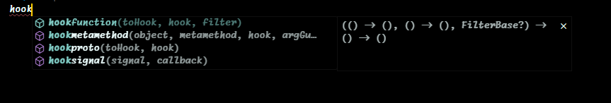
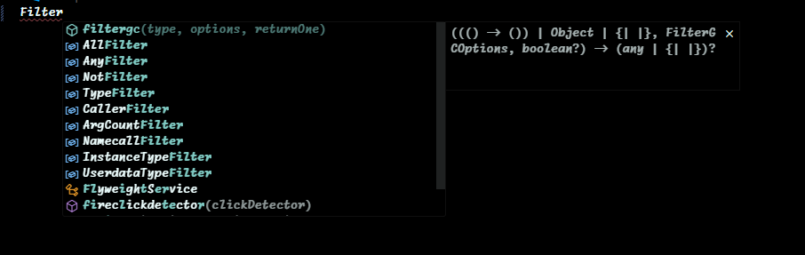
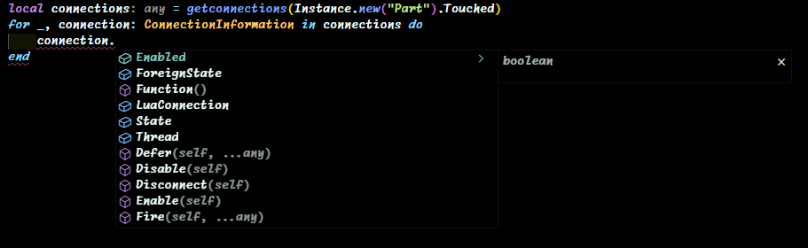
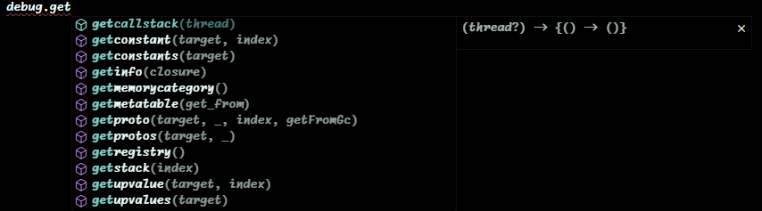
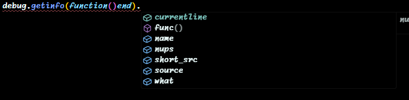
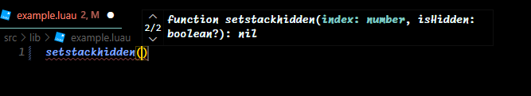
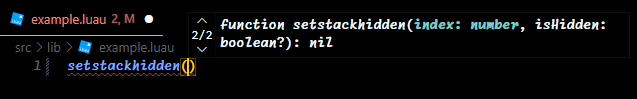
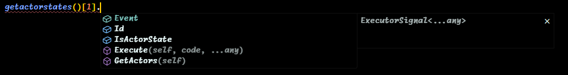

# Universal Executor API Definition File (Ver. 1.0)
### Get rid of the *"UnknownGlobal"* errors and get the best typechecking I could provide for your projects!

The definition provides type definitions for common function of executor APIs. Also (partially) defines types for Synapse X V3, Wave, Synapse Z, Nihon.

!🟥 ONLY WORKS WITH [Luau Language Server](https://marketplace.visualstudio.com/items?itemName=JohnnyMorganz.luau-lsp) 🟥!
**Contribution would be really appreciated!**


## How to use?
You can manually install everything or use my [installer script](./install.cmd).

You need to copy the repository folder into your workspace folder and execute [install.cmd](./install.cmd) to successfully install the files!

*Be careful not to launch the script twice! It may break the installed setting!*

### Manual Installation
1. Download the ["dfiles" folder](./dfiles) and put it inside your scripting workspace.
2. Open the extension settings, find the "Definition Files" setting and add "dfiles/executor.d.luau"
   
   **OR**
   
   add this to your settings.json:
   ```json
   "luau-lsp.types.definitionFiles": [
		"dfiles/executor.d.luau"
	]
	```


## Warning!
**Keep in mind that different executors may not have the functions that are present in the file! Be sure to know what functions your executor has! I tried to add different aliases with different arguments to add more support!**


## Why?
I just got tired of the errors in my projects and decided to spend 4 hours copying functions from various documentations.


## Where did you get the functions?
Synapse X V3, Nihon and Wave documentations. I didn't want to split the functions into different files for each executor, so I put everything in one file.


## Showcase









